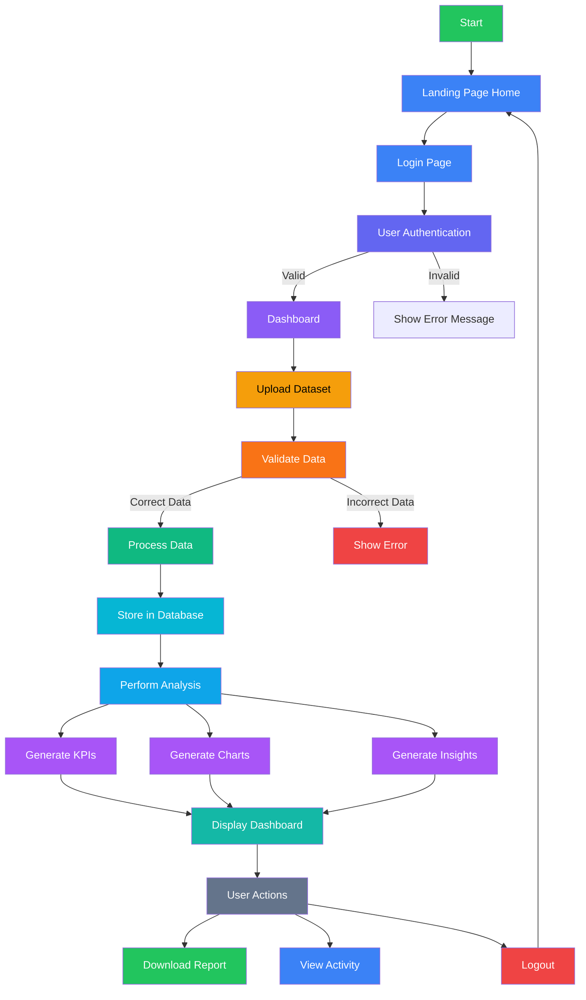

```mermaid
flowchart TD

    A[Start] --> B[Landing Page Home]
    B --> C[Login Page]
    C --> D[User Authentication]

    D -->|Valid| E[Dashboard]
    D -->|Invalid| F[Show Error Message]

    E --> G[Upload Dataset]
    G --> H[Validate Data]

    H -->|Correct Data| I[Process Data]
    H -->|Incorrect Data| J[Show Error]

    I --> K[Store in Database]
    K --> L[Perform Analysis]

    L --> M[Generate KPIs]
    L --> N[Generate Charts]
    L --> O[Generate Insights]

    M --> P[Display Dashboard]
    N --> P
    O --> P

    P --> Q[User Actions]
    Q --> R[Download Report]
    Q --> S[View Activity]
    Q --> T[Logout]

    T --> B
    
    %% COLORS
    style A fill:#22c55e,color:#fff
    style B fill:#3b82f6,color:#fff
    style C fill:#3b82f6,color:#fff
    style D fill:#6366f1,color:#fff

    style E fill:#8b5cf6,color:#fff
    style G fill:#f59e0b,color:#000
    style H fill:#f97316,color:#fff

    style I fill:#10b981,color:#fff
    style J fill:#ef4444,color:#fff

    style K fill:#06b6d4,color:#fff
    style L fill:#0ea5e9,color:#fff

    style M fill:#a855f7,color:#fff
    style N fill:#a855f7,color:#fff
    style O fill:#a855f7,color:#fff

    style P fill:#14b8a6,color:#fff
    style Q fill:#64748b,color:#fff

    style R fill:#22c55e,color:#fff
    style S fill:#3b82f6,color:#fff
    style T fill:#ef4444,color:#fff
    
```
